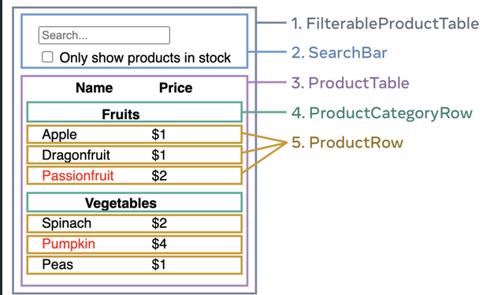

# Thinking in React: A Methodical Approach to Development

Before diving into React development, it's crucial to conceptualize the structure and flow of your application. Here's a systematic guide to help you think through your React projects:

First, imagine that you already have a JSON API and a _mockup_ from a designer.

## Step 1: Break Down the UI into a Component Hierarchy

Begin by breaking down the UI into a hierarchy of components. Each component in the mockup should translate to a distinct element in your hierarchy:

1. `FilterableProductTable`
    - `SearchBar`
    - `ProductTable`
        - `ProductCategoryRow`
        - `ProductRow`

## Step 2: Build a Static Version in React

Start by constructing a static version of your app. Render the UI from your data model without implementing any interactivity initially. Focus on creating reusable components that receive data via props.

## Step 3: Determine the Minimal UI State Representation

Identify the minimal but complete representation of UI state. Ask yourself the following questions to distinguish state from props:

- Does it remain unchanged over time? If so, it's not state.
- Is it passed from a parent via props? If so, it's not state.
- Can you compute it based on existing state or props? If so, it's not state.

The remaining attributes are likely to be state. For instance:
- The search text and checkbox values are considered state since they change over time and can't be computed from other data.
- The original list of products and the filtered list derived from it are not state since they can be computed.

## Step 4: Determine Where State Should Reside

Identify the components that need to manage state and decide where the state should live based on the React guidelines.

## Step 5: Implement Inverse Data Flow

Enable data flow in both directions by supporting inverse data flow. This means that components deep in the hierarchy should be able to update the state, allowing for dynamic interactions. Utilize event handling to update state in response to user input, especially in forms.

Following these steps will help you develop well-structured, maintainable React applications with clear data flow and component hierarchy.

_Note:_ It's essential to read the documentation thoroughly and conduct research on concepts that aren't clear to you. Understanding the intricacies of the tools and technologies you're working with is crucial for effective problem-solving and efficient development. Don't hesitate to explore resources, ask questions, and seek clarification whenever needed.

This readme is powred by ChatGPT.